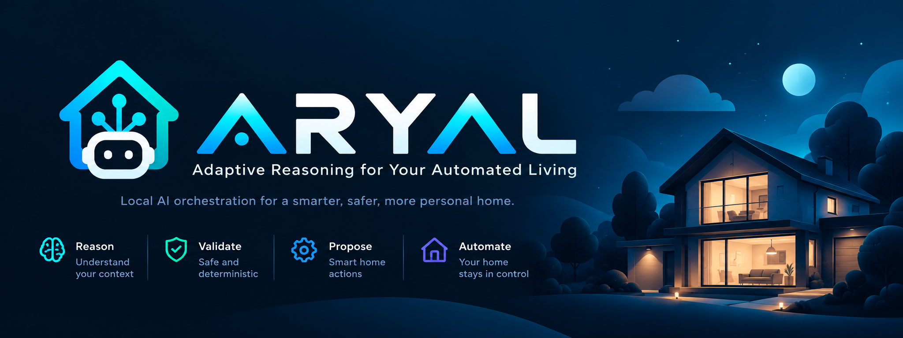
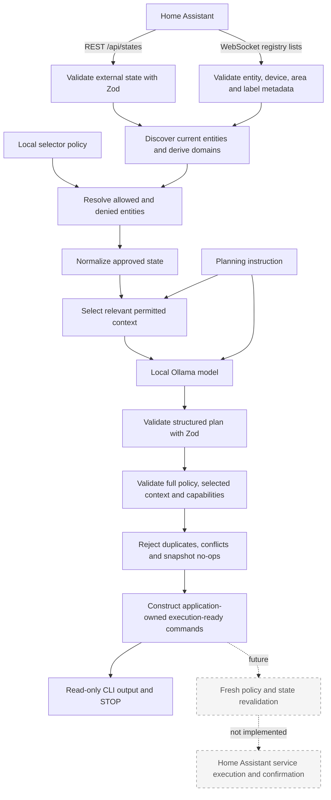

<p align="center">
  
</p>

# ARYAL

**Adaptive Reasoning for Your Automated Living**

_Your home. Your intelligence. Your control._

ARYAL is a privacy-first, local AI orchestration framework that connects contextual intelligence
with safe, deterministic smart home automation.

It integrates with Home Assistant and locally hosted language models to interpret natural language,
reason about contextual information, and propose actions within explicitly defined security
boundaries.

Home Assistant remains the source of truth. The model receives only explicitly permitted,
normalized state and produces structured proposed actions that are schema-validated and checked
against deterministic entity policy. Application code checks execution readiness and constructs
minimal service commands from accepted proposals using the planning snapshot.

> **Status:** Early development. Read-only AI planning is experimental. The current implementation
> cannot execute Home Assistant service calls.

## Why this project exists

Connecting an LLM directly to a home automation system conflates several responsibilities that
should remain separate:

- **Reasoning:** deciding what might be appropriate from an instruction and selected context.
- **Authorization:** determining which entities the system is permitted to control.
- **Validation:** checking untrusted model output against schemas and deterministic rules.
- **Execution:** making an approved Home Assistant service call and confirming its result.

An LLM is useful for interpreting intent and proposing a plan, but natural-language output is not
authorization. ARYAL keeps policy and validation in deterministic application code. The
execution stage is intentionally absent while those boundaries are developed and tested.

## Architecture



Discovery determines what exists. Policy determines what the AI may reason about or propose
actions for. Finding an entity in Home Assistant never grants permission by itself.

Current state comes from REST `/api/states`. A short-lived, read-only Home Assistant WebSocket
connection retrieves entity, device, area, and label registries for internal policy resolution.
Registry-only entries never become controllable entities. Opaque registry IDs and raw registry
payloads are not sent to Ollama; a validated effective-area display name may be included for a
selected entity. Relevance selection runs only after policy resolution and never grants permission.

## Implemented capabilities

- Home Assistant REST state retrieval.
- Zod validation at external and model-output boundaries.
- Generic discovery of entities present in current Home Assistant state.
- Validated registry-backed device, effective-area, and label discovery, with explicit unavailable
  metadata handling and conditional REST-only fallback for conclusive legacy rules.
- Deterministic domain derivation from `entity_id`.
- Version 1 `entityId`/`domain` selectors and version 2 `deviceId`/`areaId`/`labelId` selectors.
- Default-deny and deny-overrides-allow policy behavior.
- State normalization before model exposure.
- Deterministic relevance selection of permitted entities by exact names, effective areas and
  aliases, domains, and a small observation vocabulary. Ambiguous instructions retain complete
  permitted context when it fits the configured budget.
- Local Ollama `/api/chat` integration with a configurable model.
- Structured JSON plan generation.
- Discriminated plan outcomes: `propose_actions`, `no_action`, and `insufficient_context`.
- Deterministic consistency checks between the outcome and action count.
- Canonical `turn_on` and `turn_off` model actions for `light` and `switch` entities.
- Deterministic per-domain capability and Home Assistant service resolution.
- Post-model validation against the full resolved policy, the exact selected model context, and
  the application-owned capability catalogue.
- Deterministic duplicate, conflict, and no-op rejection using selected normalized state.
- Application-owned execution-ready commands with strict domain/service/target schemas and no
  arbitrary service data.
- Read-only planning from a command-line instruction.

The local model's proposed plan is experimental and may be incomplete or incorrect. The
application validates its structure, entity policy, supported actions, and execution readiness
before displaying proposals and prepared commands.
Execution and final execution-boundary validation are planned, not implemented.

Unknown domains expose no supported control actions. The model proposes only canonical action
names; the application derives the domain and resolves the corresponding Home Assistant service.

## Safety model

The current design follows these principles:

- All LLM output is untrusted input.
- Entity authorization is default-deny.
- Deny selectors override allow selectors.
- Unknown and unapproved entities are rejected after model generation.
- Only policy-approved, normalized state is sent to the model—not the full raw Home Assistant state.
- A proposed action for a policy-allowed entity is rejected if that entity was not in the exact
  context sent to Ollama.
- The application independently derives an action's domain from its entity ID.
- The application, rather than the model, determines whether an action is supported and resolves
  its canonical Home Assistant service name.
- Structured output constraints are enforced by application-side Zod validation, even when the
  same JSON Schema is supplied to Ollama.
- Every duplicated entity/action occurrence and every conflicting proposal for an entity is rejected.
- No-op checks use the exact selected normalized planning snapshot.
- Service commands contain application-owned domain, service, and a single entity target. No
  model reason, arbitrary target, or service data is copied into a command.
- Any future execution stage must revalidate policy and state immediately before dispatch.
- The current application makes no Home Assistant service calls.

Post-model policy validation covers entity policy and canonical power-action capabilities for
`light` and `switch`. A separate execution-readiness layer rejects duplicates, conflicts, and
snapshot no-ops and constructs minimal commands. Readiness is based on the planning snapshot;
fresh policy/state revalidation and actual execution are not implemented.

## Relevance selection and context budget

Selection is deterministic and uses no extra model call or external service. It matches explicit
entity IDs and friendly names, validated effective-area names and aliases, and a small set of
domain terms. For example, “Turn on kitchen lights” selects permitted kitchen lights; “Turn off
all lights” selects every permitted light; and “Turn on bedroom lamp” can select a named lamp.
Presence, temperature, and weather questions select relevant permitted read-only observations.
Motion alone is not treated as proof that somebody is home.

An instruction without a clear target, such as “I'm going to bed,” conservatively includes all
permitted entities. A clearly targeted request with no permitted match returns
`insufficient_context` without calling Ollama. Selection never silently truncates a broad set.
The planning budget measures the complete serialized Ollama request (including prompt, instruction,
schema, and selected entities) plus 4,096 bytes of output headroom. If the required complete
selection exceeds `PLANNING_REQUEST_MAX_BYTES`, ARYAL returns `insufficient_context` and does not
call Ollama. This byte limit is a conservative application guard, not an exact model token count;
adjust it for the locally deployed model and available memory.

Opaque device and label IDs, registry payloads, and unselected entities are not sent to Ollama.
Area display names and narrowly validated observation classes or units may be included for
selected entities. AI-assisted relevance selection is a separate future milestone.

## Entity policy

Local authorization is configured in `config/entity-policy.json`:

```json
{
	"version": 1,
	"allow": [{"domain": "light"}, {"entityId": "switch.example_switch"}],
	"deny": [{"domain": "lock"}, {"entityId": "switch.example_critical_device"}]
}
```

Policy semantics:

- Selectors within `allow` are OR alternatives.
- Selectors within `deny` are OR alternatives.
- Fields within one selector are AND conditions.
- An entity must match at least one allow selector.
- Any matching deny selector removes permission.
- An empty `allow` array permits nothing.
- A domain selector intentionally applies to every currently discovered entity in that domain.

Use explicit entity selectors when a domain-wide grant would be too broad. See the
[entity policy documentation](docs/entity-policy.md) for more detail.

## Plan model

Ollama returns a structured proposal similar to:

```json
{
	"outcome": "propose_actions",
	"summary": "Proposed plan: Turn off the example light.",
	"actions": [
		{
			"entityId": "light.example",
			"action": "turn_off",
			"reason": "The explicit instruction requests this non-no-op change."
		}
	]
}
```

This describes a proposal; it does not represent an executed action. The schema enforces these
consistency rules:

- `propose_actions` requires at least one structured proposed action.
- `no_action` requires exactly zero actions.
- `insufficient_context` requires exactly zero actions.
- Every summary begins with `Proposed plan:`.
- Every proposed action is exactly `turn_on` or `turn_off`; aliases such as `off` and qualified
  services such as `light.turn_off` are rejected.

The model does not provide a domain, service name, or service data. After entity-policy checks, the
application derives the domain from the entity ID and resolves the action through its deterministic
capability catalogue. These validated proposals are still not executed by the current application.

## Execution readiness

The representations have separate responsibilities:

- **Model proposal (`ProposedAction`):** untrusted `entityId`, canonical `action`, and descriptive
  `reason`, validated by the structured plan schema.
- **Planning-time validated proposal (`ValidatedAction`):** a proposal that passed full-policy,
  exact-context, and capability checks, with an application-derived domain and service. It remains
  planning-only.
- **Execution-ready command (`ExecutionReadyCommand`):** a distinct branded, immutable type
  constructed by `src/execution/readiness.ts` after deterministic readiness checks. The brand marks
  application construction; it is not authorization to dispatch against a later state or policy.

`runPlanningPipeline()` preserves `validatedPlan` and adds a separate `executionReadiness` result
with accepted proposals, rejected proposals, commands, and an outcome. Readiness processes only
planning-accepted proposals and the exact selected normalized snapshot:

1. Reject all proposals for an entity with contradictory actions as `conflicting_actions`, even
   if one would be a no-op. Conflicts take precedence over duplicates.
2. Reject every occurrence of repeated identical entity/action pairs as `duplicate_action`.
   Different model reasons do not distinguish actions. There is no first/last-wins resolution.
3. Require a unique selected state, a supported action, and a known binary `on`/`off` state.
   Missing selected targets are `not_in_context`; ambiguous, non-binary, or ineligible normalized
   state is `ineligible_state`. Inconsistent domains or unsupported command routing are rejected
   as `unsupported_action`.
4. Reject `turn_on` for an already-on target and `turn_off` for an already-off target as `no_op`.
5. Independently derive the domain from the entity ID and resolve the canonical service through
   the existing capability catalogue. Construct and validate an exact single-entity command.

For example, a permitted, selected off light with a unique `turn_on` proposal produces:

```json
{
	"domain": "light",
	"service": "turn_on",
	"target": {"entity_id": "light.example"}
}
```

The private strict command schema admits only these fields and supported light/switch power
services. Service data is explicitly absent: there is no `data` field or generic dictionary.
Target and command objects are frozen. Model reason text and proposal routing fields never
influence command construction. Rejection diagnostics retain the existing planning proposal
fields and machine-readable reasons, without adding registry metadata.

Readiness uses its own `ExecutionReadinessOutcome`, separate from planning outcomes:

| Planning outcome       | Execution-ready commands                              | Readiness outcome      |
| ---------------------- | ----------------------------------------------------- | ---------------------- |
| `propose_actions`      | At least one, including mixed accepted/rejected plans | `ready`                |
| `propose_actions`      | None; every planning-accepted proposal was rejected   | `rejected`             |
| `no_action`            | None                                                  | `no_action`            |
| `insufficient_context` | None                                                  | `insufficient_context` |

`no_action` preserves a planning conclusion that no action is needed. `rejected` means actions were
proposed but deterministic readiness checks rejected every planning-accepted proposal. The original
planning result remains available for diagnostics, and no replacement actions are generated.

Processing stops after command preparation and read-only CLI output. No Home Assistant services
are called, no fresh snapshot is fetched, and `DRY_RUN` does not enable dispatch. A future dispatcher
must consume the distinct command type, revalidate current policy and state immediately before
dispatch, and confirm Home Assistant results before reporting success. Critical infrastructure
denials and the prohibition on autonomous unlocking must remain enforced.

## Requirements

- Node.js 24 or newer.
- npm.
- A reachable Home Assistant instance and a Home Assistant long-lived access token.
- A reachable Ollama instance with a local model installed.

The default development configuration uses `gemma4:e2b`. The Ollama integration is intended to
remain model-agnostic where practical, so another locally available model can be selected through
configuration.

The repository includes `.mise.toml` for Node 24. If you use [mise](https://mise.jdx.dev/), you can
install the configured tool version with:

```sh
mise install
```

Mise is optional; any suitable Node.js 24 installation works.

## Installation

Clone the repository:

```sh
git clone https://github.com/aabiskar1/aryal-home.git
cd aryal-home
npm install
```

## Configuration

Create the local environment file:

```sh
cp .env.example .env
```

The example contains only generic values:

```dotenv
HA_URL=http://homeassistant.local:8123
HA_TOKEN=replace-with-your-home-assistant-token

OLLAMA_URL=http://localhost:11434
OLLAMA_MODEL=gemma4:e2b
PLANNING_REQUEST_MAX_BYTES=24576
```

Set `HA_URL`, `HA_TOKEN`, `OLLAMA_URL`, and `OLLAMA_MODEL` for your environment. Adjust
`PLANNING_REQUEST_MAX_BYTES` if the complete selected request exceeds your local model budget.
The current implementation has no service-execution path.

Create the local entity policy:

```sh
cp config/entity-policy.example.json config/entity-policy.json
```

Review the policy carefully before running the planner. Both `.env` and
`config/entity-policy.json` are intentionally ignored by Git and must remain local.

## Running

Run the TypeScript entrypoint directly with an explicit planning instruction:

```sh
node --env-file=.env --import=tsx src/index.ts \
  "Review the allowed lights and propose whether any should be turned off."
```

Alternatively, build first and run the generated JavaScript:

```sh
npm run build
node --env-file=.env dist/index.js \
  "Review the allowed lights and propose whether any should be turned off."
```

The CLI reports the number of received, discovered, and allowed entities; aggregate selection
diagnostics; the planning outcome and untrusted summary; planning-accepted proposals and rejection
counts; the separate execution-readiness outcome, prepared commands, and readiness rejections;
and this final confirmation:

```text
No Home Assistant service calls were made.
```

Output may contain local entity information, so treat terminal logs as installation-sensitive.

## Development

The project uses TypeScript and ESM, Got for HTTP transport, Zod for runtime validation, Vitest for
tests, XO for linting, and Prettier for formatting.

Run the complete local verification suite before committing:

```sh
npm run format
npm run lint
npm run build
npm test
```

Useful individual scripts include `npm run test:watch`, `npm run format:check`, and
`npm run lint:fix`.

## Roadmap

Implemented:

- Home Assistant state retrieval and external-data validation.
- Policy-approved state normalization and deterministic relevance selection.
- Registry-enriched state discovery and versioned selector policy.
- Read-only local LLM planning with structured outcomes.
- Deterministic capability and service modelling.
- Canonical action and service semantics.
- Deterministic entity-policy, selected-context, capability, and service validation after model
  generation.
- Deterministic duplicate/conflict/no-op validation and minimal application-owned command
  construction, using the selected planning snapshot.

Planned:

- AI-assisted relevance selection, if needed after deterministic selection is evaluated.
- Richer capability-aware normalization.
- Typed validation for richer action/service data if capabilities are extended.
- Controlled Home Assistant execution with confirmation.
- Fresh policy and state validation immediately before dispatch.

Execution will not be added until the deterministic authorization and validation boundaries are in
place.

## Privacy

Local deployment is a design goal, but using Ollama does not automatically guarantee privacy in
every network or deployment configuration. Operators remain responsible for where Home Assistant,
Ollama, logs, and model data are hosted.

- Never commit `.env` or access tokens.
- Keep the real `config/entity-policy.json` local.
- Do not commit raw Home Assistant state or inventory dumps.
- Do not place installation-specific entity IDs, hostnames, URLs, or network addresses in public
  examples, tests, or documentation.
- Review logs before sharing them because read-only planning output can still identify local
  entities.

## Author

**Aabishkar Aryal**

## License

Copyright 2026 Aabishkar Aryal.

Licensed under the [Apache License 2.0](LICENSE). See [NOTICE](NOTICE) for attribution information.

## Contributing and project maturity

This is an early-stage personal open-source project. Changes should stay focused, preserve the
read-only safety boundary, include relevant tests, and pass the complete development verification
suite before submission.
