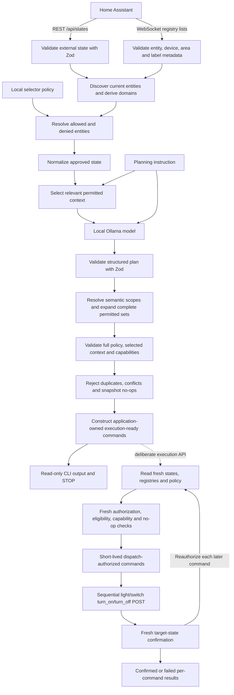

<p align="center">
  
</p>

# ARYAL

**Adaptive Reasoning for Your Automated Living**

_Your home. Your intelligence. Your control._

ARYAL is a privacy-first, local AI orchestration framework that connects contextual intelligence
with safe, deterministic smart home automation.

It integrates with Home Assistant and locally hosted language models to interpret natural language,
reason about contextual information, and propose actions within explicitly defined security
boundaries.

Home Assistant remains the source of truth. The model receives only explicitly permitted,
normalized state and produces structured entity or set intents. Application code expands validated
area/domain scopes into every permitted matching entity, then checks deterministic entity policy
and execution readiness. It constructs minimal service commands from accepted proposals using the
planning snapshot.

> **Status:** Early development. The planning CLI remains read-only. A separate deliberate execution
> API can control policy-approved lights and switches with fresh authorization and state confirmation.

## Why this project exists

Connecting an LLM directly to a home automation system conflates several responsibilities that
should remain separate:

- **Reasoning:** deciding what might be appropriate from an instruction and selected context.
- **Authorization:** determining which entities the system is permitted to control.
- **Validation:** checking untrusted model output against schemas and deterministic rules.
- **Execution:** making an approved Home Assistant service call and confirming its result.

An LLM is useful for interpreting intent and proposing a plan, but natural-language output is not
authorization. ARYAL keeps policy, validation, service construction, and execution confirmation
in deterministic application code.

## Architecture



Discovery determines what exists. Policy determines what the AI may reason about or propose
actions for. Finding an entity in Home Assistant never grants permission by itself.

Current state comes from REST `/api/states`. A short-lived, read-only Home Assistant WebSocket
connection retrieves entity, device, area, and label registries for internal policy resolution.
Registry-only entries never become controllable entities. Opaque registry IDs and raw registry
payloads are not sent to Ollama; a validated effective-area display name may be included for a
selected entity. Relevance selection runs only after policy resolution and never grants permission.
Actionable lights/switches and read-only occupancy/presence or temperature/humidity observations are
distinct model context lists. Observation exposure requires the existing allow/deny policy and grants
no execution authority. See [planning context and execution authority](docs/architecture.md).

## Implemented capabilities

- Home Assistant REST state retrieval.
- Zod validation at external and model-output boundaries.
- Generic discovery of entities present in current Home Assistant state.
- Validated registry-backed device, effective-area, and label discovery, with explicit unavailable
  metadata handling and conditional REST-only fallback for conclusive legacy rules.
- Deterministic domain derivation from `entity_id`.
- Version 1 `entityId`/`domain` selectors and version 2 `deviceId`/`areaId`/`labelId` selectors.
- Default-deny and deny-overrides-allow policy behavior.
- State normalization before model exposure.
- Deterministic relevance selection of permitted entities by exact names, effective areas and
  aliases, domains, and a small observation vocabulary. Ambiguous instructions retain complete
  permitted context when it fits the configured budget.
- Local Ollama `/api/chat` integration with a configurable model.
- Structured JSON plan generation.
- Discriminated plan outcomes: `propose_actions`, `no_action`, and `insufficient_context`.
- Deterministic consistency checks between the outcome and action count.
- Canonical `turn_on` and `turn_off` model actions for `light` and `switch` entities.
- Deterministic per-domain capability and Home Assistant service resolution.
- Post-model validation against the full resolved policy, the exact selected model context, and
  the application-owned capability catalogue.
- Deterministic duplicate, conflict, and no-op rejection using selected normalized state.
- Application-owned execution-ready commands with strict domain/service/target schemas and no
  arbitrary service data.
- Independent read-only pre-dispatch revalidation against freshly retrieved state, registries, and
  current policy, producing distinct dispatch-authorized commands.
- Read-only planning from a command-line instruction.
- Separate natural-language execution CLI that reuses planning and the production execution API.
- Separate deliberate execution API for sequential light/switch power services with bounded fresh
  confirmation reads, explicit partial results, and no automatic service retries.

The local model's proposed plan is experimental and may be incomplete or incorrect. The
application validates its structure, entity policy, supported actions, and execution readiness
before displaying proposals and prepared commands.
Fresh pre-dispatch validation remains independently available. The separate execution API always
uses it before dispatch and requires fresh confirmation before reporting success.

Unknown domains expose no supported control actions. The model proposes only canonical action
names; the application derives the domain and resolves the corresponding Home Assistant service.

## Safety model

The current design follows these principles:

- All LLM output is untrusted input.
- Entity authorization is default-deny.
- Deny selectors override allow selectors.
- Unknown and unapproved entities are rejected after model generation.
- Only policy-approved, normalized state is sent to the model—not the full raw Home Assistant state.
- A proposed action for a policy-allowed entity is rejected if that entity was not in the exact
  context sent to Ollama.
- The application independently derives an action's domain from its entity ID.
- The application, rather than the model, determines whether an action is supported and resolves
  its canonical Home Assistant service name.
- Structured output constraints are enforced by application-side Zod validation, even when the
  same JSON Schema is supplied to Ollama.
- Every duplicated entity/action occurrence and every conflicting proposal for an entity is rejected.
- No-op checks use the exact selected normalized planning snapshot.
- Service commands contain application-owned domain, service, and a single entity target. No
  model reason, arbitrary target, or service data is copied into a command.
- Fresh pre-dispatch validation reloads state, registries, and policy for the whole batch.
- Execution invokes fresh validation immediately before dispatch and repeats it for later commands
  deferred by earlier dispatch/confirmation. Neither command type represents permanent permission.
- Only light/switch `turn_on` and `turn_off` can execute, with a single entity target and no arbitrary
  service data. Successful HTTP responses require separate fresh state confirmation.

Post-model policy validation covers entity policy and canonical power-action capabilities for
`light` and `switch`. A separate execution-readiness layer rejects duplicates, conflicts, and
snapshot no-ops and constructs minimal commands. Readiness is based on the planning snapshot.
Independent fresh pre-dispatch validation checks current authorization and state before the explicit
execution API dispatches. The planning CLI stops at execution-ready commands.

## Relevance selection and context budget

Selection is deterministic and uses no extra model call or external service. It matches explicit
entity IDs and friendly names, validated effective-area names and aliases, and a small set of
domain terms. For example, “Turn on kitchen lights” selects permitted kitchen lights; “Turn off
all lights” selects every permitted light; and “Turn on bedroom lamp” can select a named lamp.
Presence/occupancy, temperature, and humidity requests select relevant permitted read-only observations
in a separate evidence list, narrowed by area where possible. Motion alone is not proof of presence.

An instruction without a clear target, such as “I'm going to bed,” conservatively includes all
permitted actionable entities. Observations require an explicit target or relevant vocabulary;
recognized conditional room goals return `insufficient_context` when required area evidence is missing.
A clearly targeted request with no permitted match returns
`insufficient_context` without calling Ollama. Selection never silently truncates a broad set.
The planning budget measures the complete serialized Ollama request (including prompt, instruction,
schema, selected actionable entities, and observations) plus 4,096 bytes of output headroom. If the required complete
selection exceeds `PLANNING_REQUEST_MAX_BYTES`, ARYAL returns `insufficient_context` and does not
call Ollama. This byte limit is a conservative application guard, not an exact model token count;
adjust it for the locally deployed model and available memory.

Opaque device and label IDs, registry payloads, and unselected entities are not sent to Ollama.
Area display names and narrowly validated observation classes or units may be included for
selected entities. AI-assisted relevance selection is a separate future milestone.

## Entity policy

Local authorization is configured in `config/entity-policy.json`:

```json
{
	"version": 1,
	"allow": [{"domain": "light"}, {"entityId": "switch.example_switch"}],
	"deny": [{"domain": "lock"}, {"entityId": "switch.example_critical_device"}]
}
```

Policy semantics:

- Selectors within `allow` are OR alternatives.
- Selectors within `deny` are OR alternatives.
- Fields within one selector are AND conditions.
- An entity must match at least one allow selector.
- Any matching deny selector removes permission.
- An empty `allow` array permits nothing.
- A domain selector intentionally applies to every currently discovered entity in that domain.

Use explicit entity selectors when a domain-wide grant would be too broad. See the
[entity policy documentation](docs/entity-policy.md) for more detail.

## Plan model

Ollama returns a structured proposal similar to:

```json
{
	"outcome": "propose_actions",
	"summary": "Proposed plan: Turn off the example light.",
	"actions": [
		{
			"entityId": "light.example",
			"action": "turn_off",
			"reason": "The explicit instruction requests this non-no-op change."
		}
	]
}
```

This describes a proposal; it does not represent an executed action. The schema enforces these
consistency rules:

- `propose_actions` requires at least one structured proposed action.
- `no_action` requires exactly zero actions.
- `insufficient_context` requires exactly zero actions.
- Every summary begins with `Proposed plan:`.
- Every proposed action is exactly `turn_on` or `turn_off`; aliases such as `off` and qualified
  services such as `light.turn_off` are rejected.

The model may instead propose a strict `set_action` with a semantic area and supported domain; see
[deterministic set intents](docs/set-intents.md). It never provides service names or service data.
After expansion and entity-policy checks, the application derives routing from the entity ID and
resolves the action through its deterministic capability catalogue. These validated proposals remain
planning-only; execution requires the
separate readiness, fresh authorization, and dispatch boundaries.

## Execution readiness

The representations have separate responsibilities:

- **Model proposal (`ProposedAction`):** untrusted `entityId`, canonical `action`, and descriptive
  `reason`, validated by the structured plan schema. `Plan.actions` also accepts `SetAction` semantic
  intents. Expansion produces a `ConcretePlan` of `ProposedAction` members before policy validation.
- **Planning-time validated proposal (`ValidatedAction`):** a proposal that passed full-policy,
  exact-context, and capability checks, with an application-derived domain and service. It remains
  planning-only.
- **Execution-ready command (`ExecutionReadyCommand`):** a distinct branded, immutable type
  constructed by `src/execution/readiness.ts` after deterministic readiness checks. The brand marks
  application construction; it is not authorization to dispatch against a later state or policy.
- **Dispatch-authorized command (`DispatchAuthorizedCommand`):** a separate branded, immutable type
  reconstructed by `src/execution/revalidation.ts` after fresh pre-dispatch checks. It records
  authorization against that fresh batch and must not be cached as permanent permission.

`runPlanningPipeline()` preserves `validatedPlan` and adds a separate `executionReadiness` result
with accepted proposals, rejected proposals, commands, and an outcome. Readiness processes only
planning-accepted proposals and the exact selected normalized snapshot:

1. Reject all proposals for an entity with contradictory actions as `conflicting_actions`, even
   if one would be a no-op. Conflicts take precedence over duplicates.
2. Reject every occurrence of repeated identical entity/action pairs as `duplicate_action`.
   Different model reasons do not distinguish actions. There is no first/last-wins resolution.
3. Require a unique selected state, a supported action, and a known binary `on`/`off` state.
   Missing selected targets are `not_in_context`; ambiguous, non-binary, or ineligible normalized
   state is `ineligible_state`. Inconsistent domains or unsupported command routing are rejected
   as `unsupported_action`.
4. Reject `turn_on` for an already-on target and `turn_off` for an already-off target as `no_op`.
5. Independently derive the domain from the entity ID and resolve the canonical service through
   the existing capability catalogue. Construct and validate an exact single-entity command.

For example, a permitted, selected off light with a unique `turn_on` proposal produces:

```json
{
	"domain": "light",
	"service": "turn_on",
	"target": {"entity_id": "light.example"}
}
```

The private strict command schema admits only these fields and supported light/switch power
services. Service data is explicitly absent: there is no `data` field or generic dictionary.
Target and command objects are frozen. Model reason text and proposal routing fields never
influence command construction. Rejection diagnostics retain the existing planning proposal
fields and machine-readable reasons, without adding registry metadata.

Readiness uses its own `ExecutionReadinessOutcome`, separate from planning outcomes:

| Planning outcome       | Execution-ready commands                              | Readiness outcome      |
| ---------------------- | ----------------------------------------------------- | ---------------------- |
| `propose_actions`      | At least one, including mixed accepted/rejected plans | `ready`                |
| `propose_actions`      | None; every planning-accepted proposal was rejected   | `rejected`             |
| `no_action`            | None                                                  | `no_action`            |
| `insufficient_context` | None                                                  | `insufficient_context` |

`no_action` preserves a planning conclusion that no action is needed. `rejected` means actions were
proposed but deterministic readiness checks rejected every planning-accepted proposal. The original
planning result remains available for diagnostics, and no replacement actions are generated.

The planning CLI stops after command preparation and read-only output. It does not automatically
invoke fresh revalidation. `DRY_RUN` does not enable dispatch. Critical infrastructure denials and
the prohibition on autonomous unlocking must remain enforced.

## Fresh pre-dispatch revalidation

The lifecycle is:

```text
Model proposal → planning-validated proposal → execution-ready command (planning snapshot)
→ fresh pre-dispatch revalidation → dispatch-authorized command
→ Home Assistant service POST → fresh confirmation → confirmed/failed execution result
```

`revalidateForDispatch(commands)` in `src/execution/revalidation.ts` is an independent, read-only
boundary used by the dispatcher. For each nonempty batch it invokes the existing REST state reader,
registry reader, and local policy loader once each, concurrently. It validates those inputs, reruns
discovery/enrichment, and resolves current policy against the newly discovered inventory. It accepts
no planning snapshot or previously resolved policy and has no snapshot cache. Empty input performs
no reads and needs no credential-dependent imports.

Every command is checked against the same fresh batch. The incoming brand grants no authority:
strict shape validation rejects extra fields, service data, and arbitrary target shapes. The stage
requires a unique existing target with complete eligible metadata and a known binary state. It
then applies current deny/allow policy, derives the domain from the fresh entity ID, re-resolves
the canonical capability/service, checks exact routing agreement, and independently rejects fresh
no-ops. Authorized domain/service/target objects are newly constructed, strictly validated, and
frozen; incoming objects are never returned as authorized commands.

Unlike the conditional REST-only planning fallback, an unavailable registry snapshot rejects the
fresh batch because current disablement cannot be established. Missing or invalid state/policy
reads also reject the batch, without falling back to planning inputs or exposing transport errors.
Duplicate registry IDs invalidate the snapshot. Duplicate fresh state entries or repeated command
targets reject affected commands as ambiguous; no first/last-wins decision is made.

`PreDispatchRevalidationResult` contains authorized `commands` and one ordered `decisions` entry
per input command, including its original index. Outcomes are independent of planning/readiness:

| Outcome       | Meaning                                                                  |
| ------------- | ------------------------------------------------------------------------ |
| `authorized`  | At least one command passed, including mixed authorized/rejected batches |
| `rejected`    | Commands were supplied and none passed                                   |
| `no_commands` | Input was empty; no fresh reads occurred                                 |

Rejection reasons are deterministic:

| Reason                 | Meaning                                                                      |
| ---------------------- | ---------------------------------------------------------------------------- |
| `invalid_command`      | Incoming shape, target syntax, or extra payload fields are invalid           |
| `snapshot_unavailable` | A fresh read or schema validation failed, or registry data is unavailable    |
| `target_missing`       | Target no longer appears in fresh REST state                                 |
| `ambiguous_target`     | Fresh state has duplicate target entries or the batch repeats a target       |
| `ineligible_state`     | Target is disabled, metadata is incomplete, or state is not known `on`/`off` |
| `denied`               | Current policy denies the target, overriding allows                          |
| `not_allowed`          | Current policy no longer grants permission                                   |
| `unsupported_action`   | The current capability catalogue cannot resolve or support the action        |
| `routing_mismatch`     | Supplied domain/service differs from deterministic current routing           |
| `fresh_no_op`          | Current state already satisfies the command                                  |

Shape and batch-read failures are checked first, followed by repeated targets, target existence and
eligibility, current policy, capability/routing, and fresh no-op checks. Eligibility is checked before
policy diagnostics so unknown/disabled targets are distinguished from policy denial. Diagnostics
include indices, validated entity IDs, reason codes, and reconstructed commands; no registry IDs,
labels, snapshot metadata, arbitrary input payloads, or transport errors are included. Mixed batches
retain passing commands in input order without inventing replacements.

`revalidateForDispatch(commands)` always uses the existing Home Assistant state reader, registry
reader, and current policy loader. Production callers cannot supply alternative readers or a cached
planning snapshot. Reader wiring is private; tests mock the read dependencies without exposing a
production injection API.

Fresh checks reduce drift between planning and dispatch. State, registries, and policy reads
are not an atomic Home Assistant transaction, and state or policy can change after validation.
The fresh stage itself remains read-only and stops at dispatch-authorized commands. The deliberate
execution API below dispatches immediately, repeats revalidation after deferral, and confirms results.

## Deliberate execution and confirmation

`executeReadyCommands(commands)` in `src/execution/dispatcher.ts` is the sole production execution
entry point. It accepts `readonly ExecutionReadyCommand[]`, runs `revalidateForDispatch()` with its
production-owned fresh readers, and sends only newly reconstructed `DispatchAuthorizedCommand`
objects to the private dispatcher. With `DRY_RUN=true`, it returns `execution_disabled` before
any authorization, service, or confirmation reads; per-input entries have the same outcome with
reason `dry_run` and no authorized command fields. Raw model proposals and planning-time `ValidatedAction` objects
cannot enter that dispatcher. No reader, transport, payload, or routing override is accepted.

The initial whole-batch validation preserves duplicate/conflict rejection. Commands execute in input
order, one POST followed by its confirmation before the next command. Each later initially authorized
command is revalidated again against fresh state, registries, and policy immediately before its POST,
because earlier dispatch and confirmation deferred it. Initial rejections remain rejected. There is
no authorization cache, execution queue, replacement action, rollback, or service-call retry.
Dispatch authorization is short-lived: any delayed execution requires revalidation again.

The non-exported transport colocated in `src/execution/dispatcher.ts` independently checks strict command
shape and re-derives routing using the application capability catalogue. The only endpoints reachable
are `/api/services/light/turn_on`, `/api/services/light/turn_off`,
`/api/services/switch/turn_on`, and `/api/services/switch/turn_off`. Bodies contain exactly
`{"entity_id":"<single entity>"}`. No brightness, arbitrary service data, area/device target,
model reason, request options, or other capability is accepted. The transport, HTTP client, confirmation
reader, and lower dispatcher are private to the module. No transport object, factory, or testing
bypass is exported; integrations can invoke only `executeReadyCommands()`. The private POST helper
also checks `DRY_RUN` as a backstop before issuing a request.
The build clears generated `dist` output before compiling so deleted transport exports cannot survive
as stale executable files.
The transport follows the [Home Assistant REST service contract](https://developers.home-assistant.io/docs/api/rest/#post-apiservicesdomainservice)
and validates the changed-state list response, including an empty list. That response never confirms
the requested result.

After a valid 2xx service response, a new GET of `/api/states/<entity_id>` must report `on` for
`turn_on` or `off` for `turn_off`. Confirmation uses a bounded retry window for Home Assistant state
propagation: at most five uncached reads, with 500 ms between reads only when a valid binary state
mismatches. It returns immediately when the expected state is observed. A missing target (404),
unknown/unavailable or other non-binary state, wrong response target, malformed response, or read failure
fails immediately.
POST requests have a 5-second timeout; confirmation reads have a 2-second timeout. Automatic HTTP
retries and redirects are disabled for this transport. Confirmation therefore allows at most 2 seconds
of polling delay plus five bounded reads. No success is reported from HTTP status alone.

`ExecutionResult` contains ordered `CommandExecutionResult` entries with original input indices:

| Per-command outcome      | Meaning                                                      |
| ------------------------ | ------------------------------------------------------------ |
| `execution_disabled`     | Configuration blocks execution; no authorization or dispatch |
| `confirmed`              | Fresh target state matches the requested power action        |
| `dispatch_failed`        | Service request, status, or response validation failed       |
| `confirmation_failed`    | POST succeeded but fresh state could not confirm the result  |
| `skipped_not_authorized` | Initial or repeated fresh validation rejected the command    |

Configuration-disabled entries use `dry_run`, separately from policy rejection reasons.
Dispatch failures use `service_request_failed`. Confirmation failures use `confirmation_read_failed`,
`target_missing`, `ineligible_state`, or `state_mismatch`; skipped commands retain the existing fresh
validation reason. Results contain only validated command fields, indices, and reason codes, with
no transport errors, response bodies, credentials, or registry metadata.

| Batch outcome            | Meaning                                                           |
| ------------------------ | ----------------------------------------------------------------- |
| `execution_disabled`     | DRY_RUN blocks execution, including for empty input               |
| `all_confirmed`          | Every input command was dispatched and confirmed                  |
| `partial_success`        | At least one confirmed; another failed or was skipped             |
| `all_failed`             | At least one dispatch attempted, but none confirmed               |
| `no_authorized_commands` | No dispatch attempted, including empty or entirely rejected input |

Partial success is explicit: an earlier state change is not rolled back if a later command fails.
A failed or timed-out request can still have changed Home Assistant state; failure means ARYAL could
not establish confirmed success. Do not automatically resubmit a failed batch. Confirmation establishes
Home Assistant's observed state, not permanent state or independent physical-device verification.

The existing planning CLI never imports or invokes execution and stays read-only for both settings.
`DRY_RUN` defaults to true and is a global execution backstop: the execution API makes zero service
POSTs, confirmation reads, or fresh authorization reads while it is true. It reports configuration
disablement, never simulated authorization or success. With `DRY_RUN=false`, deliberately calling
`executeReadyCommands()` enables the existing fresh authorization, sequential dispatch, and confirmation
flow. Disabling DRY_RUN does not make the planning CLI execute.

## Requirements

- Node.js 24 or newer.
- npm.
- A reachable Home Assistant instance and a Home Assistant long-lived access token.
- A reachable Ollama instance with a local model installed.

The default development configuration uses `gemma4:e2b`. The Ollama integration is intended to
remain model-agnostic where practical, so another locally available model can be selected through
configuration.

The repository includes `.mise.toml` for Node 24. If you use [mise](https://mise.jdx.dev/), you can
install the configured tool version with:

```sh
mise install
```

Mise is optional; any suitable Node.js 24 installation works.

## Installation

Clone the repository:

```sh
git clone https://github.com/aabiskar1/aryal-home.git
cd aryal-home
npm install
```

## Configuration

Create the local environment file:

```sh
cp .env.example .env
```

The example contains only generic values:

```dotenv
HA_URL=http://homeassistant.local:8123
HA_TOKEN=replace-with-your-home-assistant-token

OLLAMA_URL=http://localhost:11434
OLLAMA_MODEL=gemma4:e2b
PLANNING_REQUEST_MAX_BYTES=24576
```

Set `HA_URL`, `HA_TOKEN`, `OLLAMA_URL`, and `OLLAMA_MODEL` for your environment. Adjust
`PLANNING_REQUEST_MAX_BYTES` if the complete selected request exceeds your local model budget.
The planning CLI remains read-only regardless of `DRY_RUN`. Service execution requires deliberately
calling the separate `executeReadyCommands()` API with `DRY_RUN=false`.

Create the local entity policy:

```sh
cp config/entity-policy.example.json config/entity-policy.json
```

Review the policy carefully before running the planner. Both `.env` and
`config/entity-policy.json` are intentionally ignored by Git and must remain local.

## Running

### Metadata maintenance audit

Inspect metadata quality separately from planning or execution:

```sh
npm run build
npm run ha-audit
npm run ha-audit -- --json
```

The audit reports missing/conflicting areas, ambiguous names, state/disablement issues,
read-only observation readiness, actionable policy hints, and dangling policy references.
It requires Home Assistant access, with no Ollama/model dependency. It performs no service calls,
registry updates, or policy writes. Suggestions are review hints; Home Assistant registry metadata
remains the source of area authority. Warnings do not cause a failing exit code.
See [audit behavior, privacy, and exit codes](docs/ha-audit.md). Keep output local or sanitize it
before sharing because entity and room names identify your installation.

### Planning only

With environment variables configured, the existing command remains read-only:

```sh
npm run build
npm start -- "Turn off the example lamp"
```

Run the TypeScript entrypoint directly with an explicit planning instruction:

```sh
node --env-file=.env --import=tsx src/index.ts \
  "Review the allowed lights and propose whether any should be turned off."
```

Alternatively, build first and run the generated JavaScript:

```sh
npm run build
node --env-file=.env dist/index.js \
  "Review the allowed lights and propose whether any should be turned off."
```

The CLI reports the number of received, discovered, and allowed entities; aggregate selection
diagnostics; semantic set expansion and member decisions; the planning outcome; planning-accepted
proposals and rejection counts; the separate execution-readiness outcome, prepared commands, and readiness rejections;
and this final confirmation:

```text
No Home Assistant service calls were made.
```

Output may contain local entity information, so treat terminal logs as installation-sensitive.

### Deliberate execution

Build first, then use the separate execution command:

```sh
npm run build
npm run execute -- "Turn off the example lamp"
```

The execute script loads `.env` if present; exported environment variables take precedence. Keep
`DRY_RUN=true` (the default) to inspect planning without Home Assistant service POSTs:

```sh
DRY_RUN=true npm run execute -- "Turn on the example lamp"
```

Set `DRY_RUN=false` only when deliberately enabling real execution. The existing `npm start` planning
command stays read-only for either setting; it uses environment variables or the explicit
`node --env-file=.env dist/index.js` form above. No execution mode or flags were added to that command.

The execution CLI accepts a natural-language instruction only, joined from its arguments. Routing
flags such as `--domain`, `--service`, and `--target`, and JSON service payloads are rejected. Users
cannot provide service data or route around the planner. Capability scope remains exactly
light/switch `turn_on` and `turn_off`.

`src/execute.ts` is a thin wrapper around `runExecutionCli()` in `src/cli/execution.ts`. The workflow
retrieves current states and registries, loads policy, discovers/enriches entities, resolves the full
policy, and calls `runPlanningPipeline()`. Only resulting `ExecutionReadyCommand` values enter
`executeReadyCommands()`, which retains the internal global DRY_RUN backstop, fresh pre-dispatch
policy/state/registry checks, sequential service dispatch, and fresh target-state confirmation.
AI proposes; deterministic application code authorizes and executes. No lower transport is exposed.

Output is pretty-printed structured JSON: instruction, aggregate selection diagnostics, validated
planning outcome/actions/rejections, readiness outcome/commands/rejections, execution outcome, and
ordered per-command results. A confirmed result identifies the entity, canonical power service,
and confirmation status. Rejected/skipped entries include entity IDs where available and reason codes.
Untrusted model summary/reason prose, registry inventory, and raw exceptions/response bodies are
omitted. The configured HA token is redacted even if it appears in instruction text. Logs still
contain intentionally displayed local entity IDs and must be treated as installation-sensitive.

| Exit code | Meaning                                                                                                                                |
| --------- | -------------------------------------------------------------------------------------------------------------------------------------- |
| `0`       | Every executable command confirmed with no earlier proposal rejections, or valid model `no_action`                                     |
| `1`       | Partial success, rejected proposals, insufficient context, no authorized commands, execution/confirmation failure, or unexpected error |
| `2`       | Empty instruction, routing flags, or structured service input                                                                          |
| `3`       | Ready commands exist but execution is disabled by DRY_RUN                                                                              |

The CLI skips execution for valid no-action plans, insufficient context, or zero readiness commands.
Set no-ops are reported as already satisfied and do not make otherwise confirmed sets partial.
Unavailable or non-permitted scope members, rejected scopes, and material validation/readiness
rejections make processing incomplete. An entirely already-satisfied set returns `no_action` without
dispatch; single-entity no-op handling remains unchanged. Post-model validation can label an entirely
rejected plan `no_action`; the CLI checks rejection
diagnostics and reports `rejected` with exit 1 in that case. No-action and rejection therefore remain
distinct. Mixed earlier rejections plus confirmed remaining commands produce CLI `partial_success`
and exit 1 while preserving the underlying execution result. No replacement actions are invented.

DRY_RUN may still retrieve planning context and invoke Ollama. When ready commands exist, the
execution API returns `execution_disabled`; the CLI explicitly says configuration blocked execution
and exits 3. It does not perform fresh authorization or confirmation reads for those disabled commands
and never claims they ran. No-action/context/rejection results keep their own outcomes and skip the
execution API instead. An HTTP 2xx response alone never counts as execution success: fresh Home
Assistant state confirmation is required. Partial success has no rollback; do not automatically
resubmit failed batches. Delayed commands still require fresh authorization again.

## Development

The project uses TypeScript and ESM, Got for HTTP transport, Zod for runtime validation, Vitest for
tests, XO for linting, and Prettier for formatting.

Run the complete local verification suite before committing:

```sh
npm run format
npm run lint
npm run build
npm test
```

Useful individual scripts include `npm run test:watch`, `npm run format:check`, and
`npm run lint:fix`.

## Roadmap

Implemented:

- Home Assistant state retrieval and external-data validation.
- Policy-approved state normalization and deterministic relevance selection.
- Registry-enriched state discovery and versioned selector policy.
- Read-only local LLM planning with structured outcomes.
- Deterministic capability and service modelling.
- Canonical action and service semantics.
- Deterministic entity-policy, selected-context, capability, and service validation after model
  generation.
- Deterministic duplicate/conflict/no-op validation and minimal application-owned command
  construction, using the selected planning snapshot.
- Independent fresh policy/state/registry revalidation and distinct dispatch-authorized commands.
- Sequential light/switch power-service execution through a separate API, with fresh confirmation.
- Explicit instruction-only execution CLI, separate from the read-only planning CLI.

Planned:

- AI-assisted relevance selection, if needed after deterministic selection is evaluated.
- Richer capability-aware normalization.
- Typed validation for richer action/service data if capabilities are extended.
- Further operational execution controls and integration, without widening the current capability scope.

The execution API preserves the deterministic authorization and validation boundaries; the planning
CLI has no execution mode.

## Privacy

Local deployment is a design goal, but using Ollama does not automatically guarantee privacy in
every network or deployment configuration. Operators remain responsible for where Home Assistant,
Ollama, logs, and model data are hosted.

- Never commit `.env` or access tokens.
- Keep the real `config/entity-policy.json` local.
- Do not commit raw Home Assistant state or inventory dumps.
- Do not place installation-specific entity IDs, hostnames, URLs, or network addresses in public
  examples, tests, or documentation.
- Review logs before sharing them because read-only planning output can still identify local
  entities.

## Author

**Aabishkar Aryal**

## License

Copyright 2026 Aabishkar Aryal.

Licensed under the [Apache License 2.0](LICENSE). See [NOTICE](NOTICE) for attribution information.

## Contributing and project maturity

This is an early-stage personal open-source project. Changes should stay focused, preserve the
planning and execution safety boundaries, include relevant tests, and pass the complete development
verification suite before submission.
